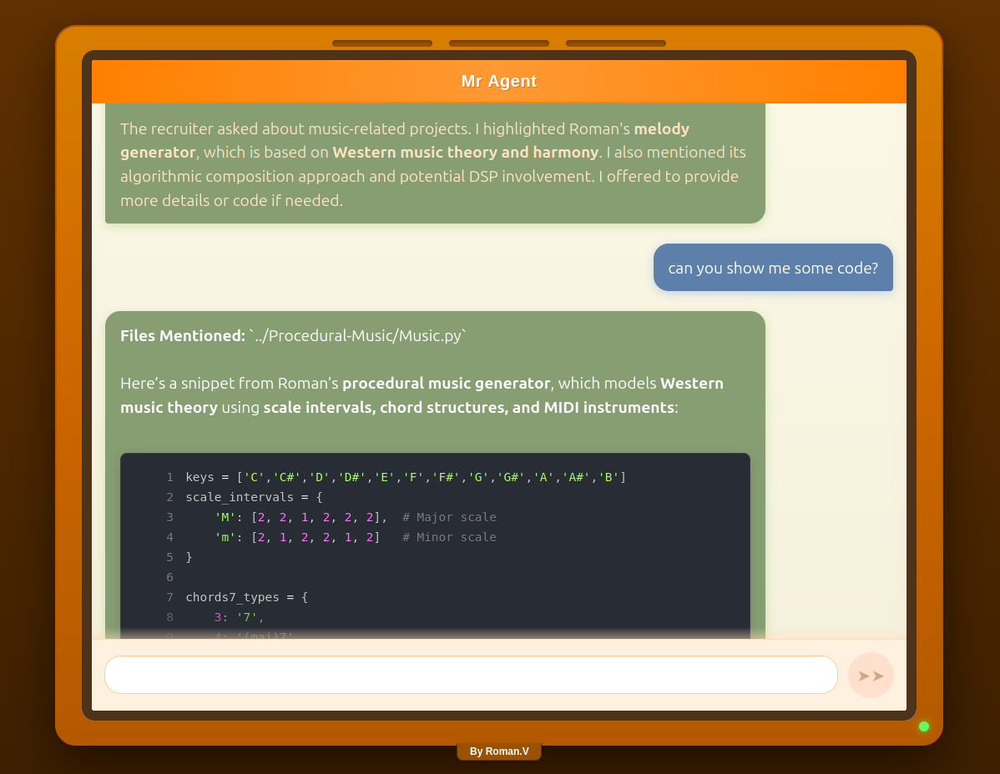

# AI Publicist

**AI Publicist** is an AI-powered representative, designed to showcase your expertise. Instead of speaking directly to recruiters, let your AI Publicist interact on your behalf—highlighting your skills, projects, and experience in a structured, engaging, and technically precise manner.

Powered by a **chatgpt-4o** and a **RAG system**, AI Publicist dynamically references your **resume, project files, and code snippets** to provide informed, contextual responses to inquiries from potential employers, collaborators, or industry peers.

---

---
## Features

### ✨ Intelligent AI Representative

- Engages in structured conversations with recruiters, presenting your background and expertise.
- Answers technical and professional questions based on your **resume and project history**.
- Adapts responses to reflect your skills, experience, and industry best practices.

### 🔍 RAG-Powered Knowledge Retrieval

- Dynamically pulls relevant information from your **resume and project files**.
- References **code snippets** and explains key technical decisions.
- Ensures accurate, context-aware responses in real-time.

### 💻 Code and Project Awareness

- Recognizes and discusses your projects in detail and work experience in detail.
- Highlights optimizations, design choices, and problem-solving approaches in your code.
- Explains technical concepts in a way that's accessible to recruiters without deep technical expertise.

### 🛠️ Configurable & Extensible

- Easily update **data sources** to refine how the AI presents your work.
- Supports **customizable prompts and AI behavior tuning** to match your communication style.
- Can be expanded with additional datasets or integrations for broader functionality.

### 📊 RAG Visualization

- Visualize the RAG system's database with an interactive UI.
- Provides insights into code chunk statistics and project details.
- Facilitates understanding of how the RAG system organizes and retrieves information.

---

## Getting Started

To get started with AI Publicist, follow these steps:

1. **Clone the Repository**: 
   ```bash
   git clone <repository-url>
   ```

2. **Install Dependencies**: 
   Navigate to the project directory and install the necessary dependencies.
   ```bash
   cd ai_publicist
   pip install -r requirements.txt
   ```

3. **Create an `.env` File**: 
   Create a `.env` file in the project root and add your OpenAI API key:
   ```
   OPENAI_API_KEY=your_openai_api_key_here
   ```

4. **Run the Backend Server**: 
   Start the backend.
   ```bash
   python src/backend/app.py
   ```

5. **Run the Frontend**: 
   Navigate to the frontend directory and start the React application.
   ```bash
   cd src/frontend
   npm install
   npm start
   ```

6. **Access the Application**: 
   Open your web browser and navigate to `http://localhost:3000` to start interacting with the AI assistant.

## Configuration

The application can be configured using the `config.json` file located in the project root. This file includes settings for the backend server, frontend server, and RAG (Retrieval-Augmented Generation) system.

**AI Publicist** – Let your AI handle the conversations while you focus on life!